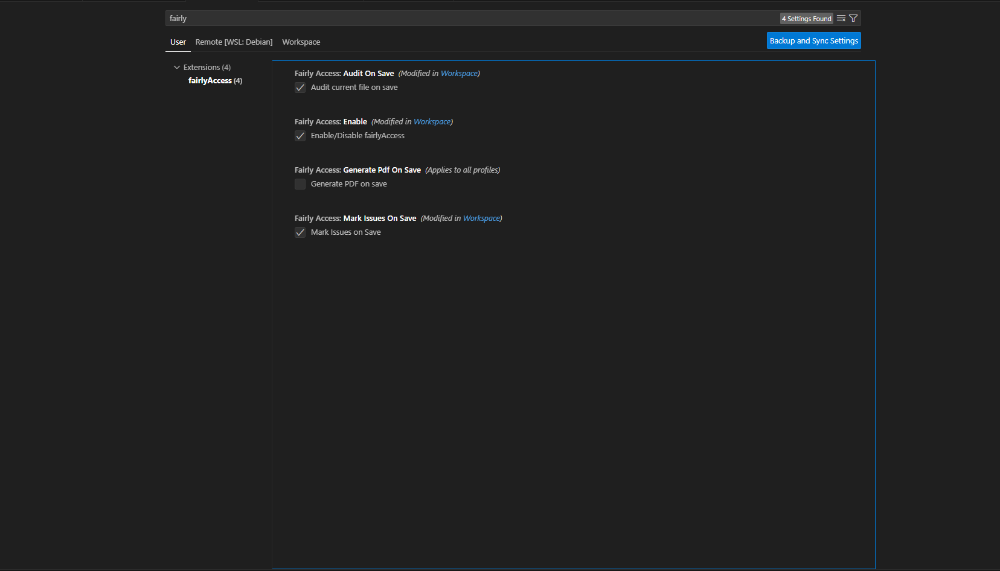
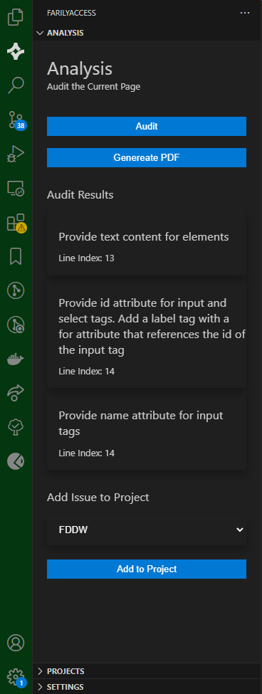

# FairlyAccess VS Code Extension

Diese Erweiterung soll Entwickler*innen dabei unterstützen HTML-Code auf Barrierefreiheit zu überprüfen und wurde im Rahmen meiner BA entwickelt.

## Installation
1. Clone:
    ```bash
    git clone https://github.com/justinpennerthkoeln/wa_vsextension.git
    ```
2. Install Deps:
    ```bash
    npm install
    ```
3. Open VSC
    ```bash
    code ws_vsextension
    ```

## Entwicklung

Nach Änderungen am Code ist es notwendig die Files neu zu Kompilieren

```bash
npm run build
```

Um die Anwendung zu testen wird ein neues Visual Studio Code Fenster geöffnet.

- ```F5``` drücken
- Oder über die Command Palette (Ctrl+Shift+P) mit ```Debug: Start Debugging```

Nun lässt sich die Erweiterung innerhalb des neu geöffneten Fensters nutzen.

## Konfiguration
Die Erweiterung bietet verschiedene Konfigurationsoptionen, die in den VS Code Einstellungen angepasst werden können:
- `fairlyAccess.enable`: Aktiviert/Deaktiviert die Erweiterung.
- `fairlyAccess.auditOnSave`: Überprüft die aktuelle Datei beim Speichern.
- `fairlyAccess.markIssuesOnSave`: Markiert Probleme im Code beim Speichern.
- `fairlyAccess.generatePdfOnSave`: Generiert einen PDF-Bericht beim Speichern.



## Analyse

Eine Analyse von HTML lässt sich durchführen, indem eine Datei gespeichert wird (wenn diese Option ausgewählt in den Einstellungen getroffen ist). 
Auch lässt sich eine Analyse die Analyse-Anzeige durchführen. Die Ergebnisse können dann in einem Projekt gespeichert und von allen Projekt-Mitgliedern genutzt werden.

